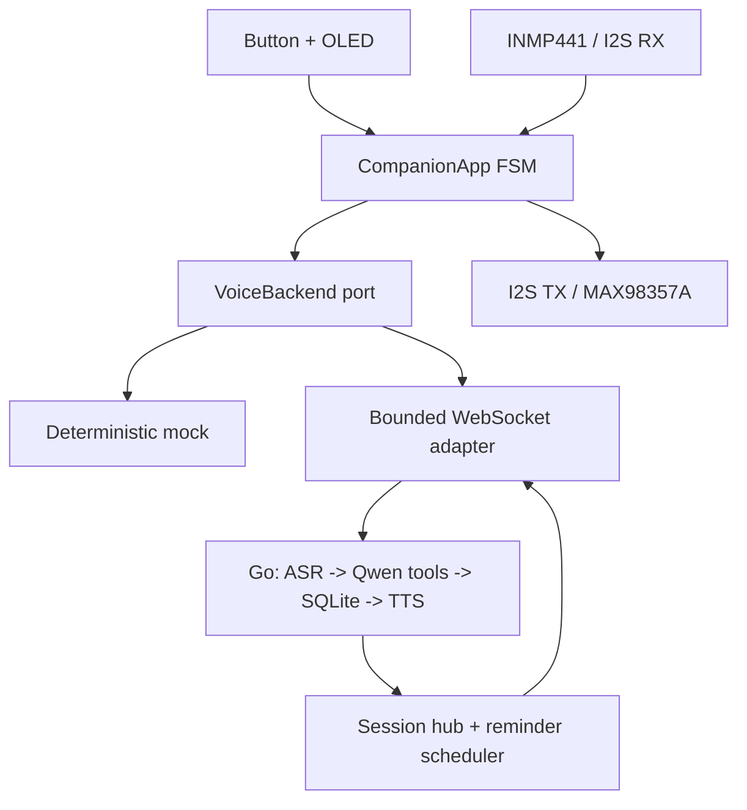
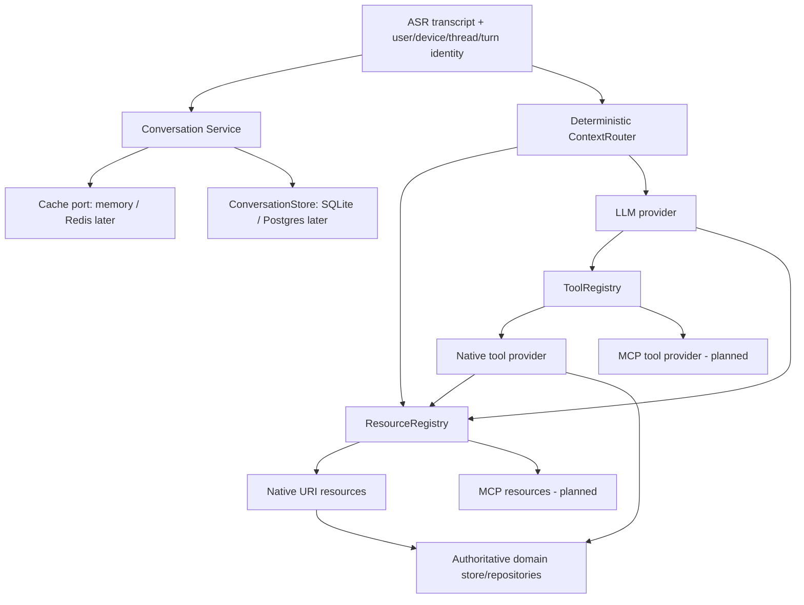

# Architecture

## Decision

Firmware is a small, replaceable hardware client. It captures/plays audio, owns
realtime interaction/UI state, local VAD and hardware-facing time sync, and
transports bounded audio/control frames. Notes, expenses, journal, reminders,
recording metadata, durable scheduling and model selection live in the backend.

## Boundaries

| Component | Owns | Must not own |
|---|---|---|
| `companion_app` | state machine, timeouts, button barge-in, basic VAD, idle/alarm behavior, audio pumping | ESP-IDF, JSON, Wi-Fi, database |
| `esp32_board` | I2S, I2C OLED, GPIO button, pin map | conversation/business logic |
| `esp32_network` | Wi-Fi, SNTP bootstrap, JSON control, ordered/bounded WS queues | notes, expenses, model prompts |
| `backend` | session cancellation, ASR/agent/TTS, SQLite, reminder scheduling, recording files | board GPIO and drivers |
| `main` | constructing and injecting concrete implementations | reusable logic |

## Runtime states

| State | Entry | Exit |
|---|---|---|
| connecting | boot/retry | protocol `hello` or failure |
| ready | connected/reply/alarm drained | button press or idle timeout |
| idle | ready inactivity | button press, alarm, backend disconnect |
| listening | button starts mic + turn | button, Smart VAD silence, or 8 s timeout |
| processing | capture stopped, ordered stop queued | `tts.start`, error, alarm queued, or barge-in |
| speaking | playback started | PCM + DMA drained, or barge-in |
| alarm | proactive `alarm` event | visible timeout or button press |
| error | port/protocol/empty-capture failure | button retry |

Button barge-in in `processing` or `speaking` cancels the backend turn, clears
queued old audio, stops the speaker, and immediately opens a new capture turn.
An alarm received during an active turn is held locally and displayed/beeped
when the current reply drains instead of corrupting the conversation state.

## Audio and queue policy

- App boundary: signed 16-bit mono PCM, 16 kHz capture.
- Capture quantum: 320 PCM samples = 20 ms; three quanta are accumulated for uplink Opus.
- Network uplink packet: raw Opus = 60 ms / 960 input samples at 16 kHz.
- Downlink: 24 kHz Opus decodes to 1,440 samples and is fed to I2S in bounded chunks.
- Short I2S reads are accumulated; a final partial frame is zero-padded.
- One bounded outbound queue carries both control and audio, preserving order.
- Full upload/playback queues fail the turn instead of growing heap memory.
- TTS playback is chunked; no full response is buffered in firmware.
- INMP441 uses a 32-bit left I2S slot, converted to signed 16-bit PCM.
- MAX98357A receives 16-bit stereo with mono samples duplicated L/R.
- Local alarm audio is a short generated tone and does not depend on backend TTS.
- The current Smart VAD is intentionally simple energy detection. ESP-SR AFE/AEC/
  WakeNet is a separate hardware-facing layer described in `AUDIO_FRONTEND.md`.

## Backend side effects and proactive delivery

- Every durable tool write uses an idempotency key.
- Batch expenses are inserted transactionally and capped at 20 items.
- Voice memos are written as a valid WAV file via temp-file + rename, then indexed in SQLite.
- Reminder delivery state is `pending -> dispatching -> sent -> fired`; `sent` is durable and waits for device acknowledgement.
- Scheduler startup recovers stale `dispatching` rows; delivered-but-unacknowledged `sent` rows retry with bounded exponential backoff.
- If no target session is connected, a claimed reminder is returned to `pending`.
- A connected device is indexed by `Device-Id`; the scheduler can push `alarm` and
  next-reminder `schedule` messages without waiting for a user turn.
- ESP32 acknowledges each alarm with `alarm_ack`; only the ACK transitions the durable row to `fired`. The reminder row itself acts as the small durable outbox for this POC.

## Backend capability/context architecture

Rules:

- `agent.Qwen` owns OpenAI-compatible message/tool-loop mechanics only. It depends on `TurnResultStore`, `conversation.Service` and `ToolRegistry`; it does not switch on tool names, construct native providers or query SQLite directly.
- `ToolRegistry` is transport-neutral. Native and MCP tools must implement the same capability contract.
- `ResourceRegistry` routes by URI scheme and is deliberately MCP-like without requiring an in-process MCP client/server hop. Native resources consume typed `domain` repository ports, not `*store.Store`.
- Conversation cache is write-through and keyed by `user_id + thread_id`. Conversation history is bounded working context; `expenses`, `budget`, `timers`, `reminders`, `notes` and `journal` remain authoritative resources.
- Timers and reminders share scheduler mechanics but persist a separate `kind`, so context queries do not conflate countdowns with calendar reminders.
- Stable native resource URIs currently include `expenses://today`, `expenses://week/current`, `expenses://month/current`, `budget://daily`, `budget://weekly`, `budget://monthly`, `reminders://today`, `reminders://upcoming`, `timers://active`, `notes://recent`, `journal://today`, and `conversation://recent`.

## Output latency rule

Tool presentations are emitted as agent events immediately after authoritative tool execution, so UI cards can reach the device before the LLM finishes verbalizing the result. TTS remains sentence-level in this POC; token-streaming LLM/ASR is a later optimization, not required for data correctness.
