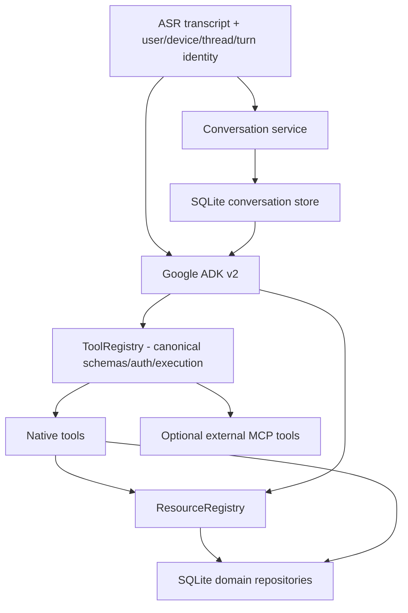

# Architecture

The production-v1 codebase is a **modular Go monolith + ESP32-S3 firmware**. Product state is authoritative in domain repositories; the LLM/agent composes language and tool calls but is not a database.

## Device/runtime boundary

The current product path is intentionally singular:

```text
ESP32-S3 hardware
  -> Wi-Fi
  -> WebSocket protocol v2
     - typed JSON control envelopes
     - binary Opus media
  -> Go session/turn runtime
  -> ASR boundary
  -> Google ADK v2 agent
  -> ToolRegistry / ResourceRegistry
  -> authoritative repositories
  -> TTS boundary
  -> WebSocket v2
  -> firmware UI/audio
```

There is no product transport selector, custom Qwen runtime selector, shared device-token fallback, or product mock-agent fallback. Future replacements must prove their target gate and then replace the current path; they must not create indefinite dual product paths.

## Session and turn runtime

Each connected device has one WebSocket reader and one writer. Protocol v2 control messages and binary Opus media remain separate. Turns are generation-scoped so barge-in/cancellation can invalidate stale model/TTS output without leaking it into a new turn.

`message_id` replay suppression is intentionally session-local. Durable domain mutations use persisted idempotency semantics in their authoritative repository/tool implementation.

## Device identity and authentication

Database-enrolled per-device credentials are the only product device-auth mechanism. The server fails closed before WebSocket upgrade when the authenticator is unavailable or when `Device-Id`/credential validation fails. Revocation makes the previously issued credential unusable.

Enrollment-owned user/device/tenant/plan claims are trusted; client headers cannot override them. Admin credential provisioning is a control-plane operation and the raw device credential is shown once, while storage keeps its digest.

## Capability/context architecture



Rules:

- `ToolRegistry` is the one tool definition/schema/authorization/execution boundary. ADK FunctionTools are generic adapters over public registry definitions, not duplicated product implementations.
- Hidden/internal tools without public definitions are never exported to the model.
- `ResourceRegistry` routes typed resources without forcing internal product reads through MCP.
- Conversation history is bounded conversational context; expenses, budgets, timers, reminders, notes and journal stay authoritative in domain storage.
- Timers/reminders may share scheduler mechanics but retain separate domain semantics.
- External MCP remains behind backend policy/egress controls; firmware never connects directly to MCP or an LLM.

## Agent runtime and durable conversation semantics

Google ADK v2 is the sole product agent runtime. `companiond` requires explicit ADK model/base-URL configuration and fails startup when it is absent.

Companion's conversation service/store remains authoritative for durable conversational continuity. ADK's in-memory session service is an execution cache only. On first use of a recreated ADK session, the bridge rehydrates bounded recent Companion history before running the turn. User and successful assistant messages are persisted through the Companion conversation service, while durable tool effects are stored by domain repositories.

This avoids introducing a second ADK-owned product database while preserving restart/reconnect continuity.

## Persistence rule

PostgreSQL/pgx is the sole product database implementation and Atlas owns schema migrations. `companiond` has no SQLite fallback, selector, shadow read or dual write. SQLite remains only in explicit cutover/recovery tooling and isolated tests. River is introduced only after the PostgreSQL transaction boundary is proven.

## Display migration rule

SSD1306 is the sole current product display. Issue #8 may physically prove a new board/display stack and #9 may implement it; once the replacement gate passes, remove the SSD1306 product adapter rather than retaining a permanent runtime display switch.

## Output latency rule

Tool presentations are emitted after authoritative tool execution so UI can reach the device before final model verbalization. Streaming model output is sentence-segmented for TTS and cancellation is generation-scoped.
