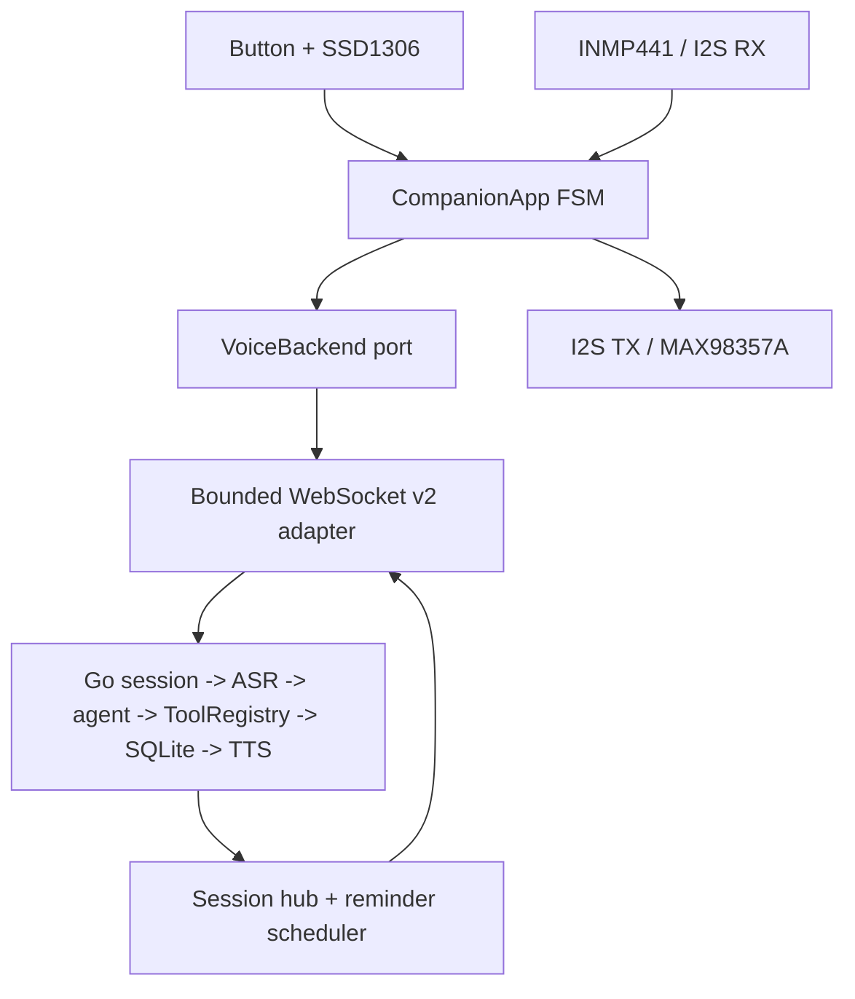
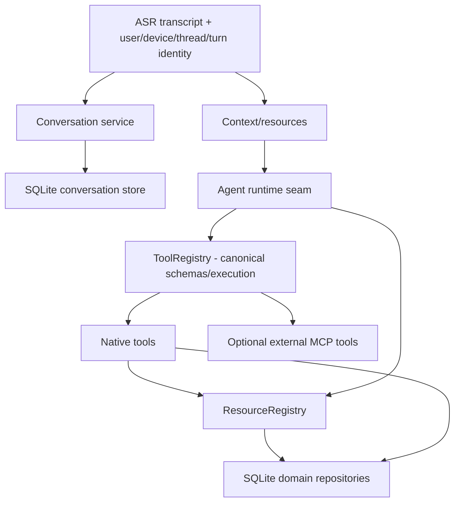

# Architecture

## Decision

Firmware is a small hardware client. It captures/plays audio, owns realtime
interaction/UI state, local VAD and hardware-facing time sync, and transports bounded
media/control frames. Notes, expenses, journal, reminders, recording metadata,
durable scheduling, policy and model orchestration live in the backend.

There is one current product transport and protocol: **Wi-Fi + WebSocket `/v2/device`
using protocol Envelope v2 for JSON control and raw Opus binary frames for media**.
Test doubles are compiled by host tests/simulation, not selected by the ESP32 product
composition root.

## Boundaries

| Component | Owns | Must not own |
|---|---|---|
| `companion_app` | state machine, timeouts, button barge-in, basic VAD, idle/alarm behavior, audio pumping | ESP-IDF, Wi-Fi, database |
| `esp32_board` | I2S, I2C SSD1306, GPIO button, pin map | conversation/business logic |
| `esp32_network` | Wi-Fi, SNTP bootstrap, protocol-v2 control, bounded WebSocket queues | notes, expenses, model prompts |
| `backend` | session cancellation, ASR/agent/TTS, SQLite, scheduling, files and policy | board GPIO/drivers |
| `main` | constructing the single product implementation set | test-double or business logic |
| `host` | deterministic simulation/fakes for firmware logic tests | product runtime selection |

Replaceability is implemented at ports. A replacement is introduced and proved, then
the replaced product implementation is removed unless multiple modes are an explicit
product requirement.

## Runtime states

| State | Entry | Exit |
|---|---|---|
| connecting | boot/retry | v2 `session.ready` or failure |
| ready | connected/reply/alarm drained | button press or idle timeout |
| idle | ready inactivity | button press, alarm, backend disconnect |
| listening | button starts mic + turn | button, Smart VAD silence, or timeout |
| processing | capture stopped, ordered stop queued | TTS start, error, alarm queued, or barge-in |
| speaking | playback started | PCM + DMA drained, or barge-in |
| alarm | proactive `alarm.fired` | visible timeout or button press |
| error | port/protocol/empty-capture failure | button retry |

Button barge-in in `processing` or `speaking` cancels the backend turn, invalidates
queued old-generation output, stops the speaker, and opens a new capture turn. An
alarm received during an active turn is held locally until the current reply drains.

## Audio and queue policy

- App boundary: signed 16-bit mono PCM, 16 kHz capture.
- Capture quantum: 320 PCM samples = 20 ms; three quanta are accumulated for current uplink Opus framing.
- Current uplink packet: raw Opus = 60 ms / 960 input samples at 16 kHz.
- Downlink: 24 kHz Opus is decoded and fed to I2S in bounded chunks.
- Short I2S reads are accumulated; a final partial frame is zero-padded.
- Bounded queues preserve accepted control/media ordering; stale generations are rejected.
- Full upload/playback queues fail the turn instead of growing memory without bound.
- TTS playback is streamed in sentence chunks; firmware does not buffer a complete answer.
- INMP441 uses a 32-bit left I2S slot converted to signed 16-bit PCM.
- MAX98357A receives duplicated mono samples over stereo I2S slots.
- Local alarm audio is generated locally and does not depend on backend TTS.
- Current Smart VAD is simple energy detection. ESP-SR AFE/AEC/WakeNet remains a future hardware-facing replacement gate described in `AUDIO_FRONTEND.md`.

## Protocol v2

All JSON device control uses `protocol.Envelope` version 2. There is no active flat
v1 parser/serializer. The backend and firmware share golden message vectors to catch
encoder taxonomy drift.

`message_id` is bounded live-session replay identity only. It is not durable across
reconnect. Stateful feature handlers that need reconnect/restart-safe mutation must
persist `idempotency_key` scoped to authenticated actor + operation + canonical
request semantics at the authoritative domain store. That durable contract remains
unproven until the feature stores implement it.

See `ADR-002-INTERACTION-PROTOCOL-CONTRACTS.md`.

## Backend side effects and proactive delivery

- Authoritative domain state is SQLite today.
- Domain writes use idempotency where implemented; the protocol session cache is not a substitute for durable feature idempotency.
- Batch expenses are transactional and bounded.
- Voice memo files use temp-file + rename before metadata indexing.
- Reminder delivery persists scheduling/delivery state and waits for device acknowledgement before final completion.
- Startup recovers stale dispatch state and retries unacknowledged delivery with bounded backoff.
- If no target session is connected, delivery returns to a retryable durable state.
- A connected device is indexed by authenticated device identity; proactive alarm/schedule v2 messages do not require a user turn.
- State + durable event use the transactional outbox when atomicity is required.

## Capability/context architecture

Rules:

- `ToolRegistry` is the one tool definition/schema/authorization/execution boundary. Agent frameworks must adapt to it rather than duplicate product semantics.
- `ResourceRegistry` routes typed resources without forcing internal product reads through MCP.
- Conversation history is bounded conversational context; expenses, budgets, timers, reminders, notes and journal stay authoritative in domain storage.
- Timers/reminders may share scheduler mechanics but retain separate domain semantics.
- External MCP remains behind backend policy/egress controls; firmware never connects directly to MCP or an LLM.

### Agent runtime migration

The selected final product runtime is ADK, but the repository still contains the
custom Qwen implementation while #15 closes full ToolRegistry parity and durable
session semantics. This is the only known deliberate runtime duplication in active
backend code. It must be removed after parity; it is not a permanent fallback
architecture.

## Persistence migration rule

SQLite is the sole current database implementation. PostgreSQL/Ent/Atlas/River work
must be implemented as a controlled migration and then hard-cut authoritative state.
Do not leave permanent SQLite/PostgreSQL dual-write or shadow-read behavior just for
backward compatibility.

## Display migration rule

SSD1306 is the sole current product display. Issue #8 may physically prove a new
board/display stack and #9 may implement it; once the replacement gate passes, remove
the SSD1306 product adapter rather than retaining a permanent runtime display switch.

## Output latency rule

Tool presentations are emitted after authoritative tool execution so UI can reach the
device before final model verbalization. Streaming model output is sentence-segmented
for TTS and cancellation is generation-scoped.
