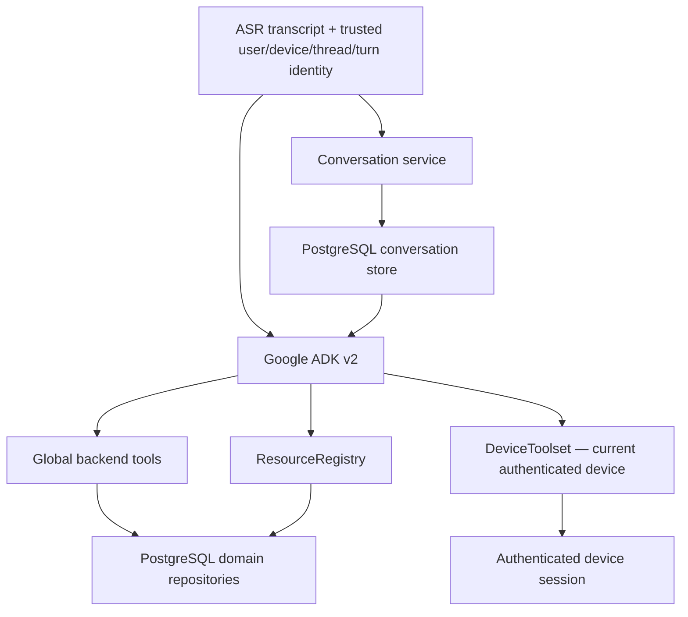

# Architecture

The Product-v1 codebase is a **modular Go monolith + ESP32-S3 firmware**. Product state is authoritative in domain repositories. The LLM/agent composes language and tool calls but is not a database.

## Device/runtime boundary

The product path is intentionally singular:

```text
ESP32-S3 hardware
  -> Wi-Fi
  -> WebSocket Protocol v2
     - typed JSON control envelopes
     - binary Opus media
     - Typed Companion Capability RPC for bounded device-local actions
  -> Go session/turn runtime
  -> ASR boundary
  -> Google ADK v2 agent
  -> backend tools/resources/domain services
  -> TTS boundary
  -> WebSocket v2
  -> firmware UI/audio
```

There is no Product-v1 transport selector, shared device-token fallback, or product mock-agent fallback. A future replacement must prove its target gate and then replace the current path. Do not keep indefinite dual product paths.

## Source-of-truth map

Use one owner for each architecture question:

| Concern | Canonical source |
| --- | --- |
| Protocol-v2 envelope/session/media and non-capability interaction taxonomy | [`ADR-002-INTERACTION-PROTOCOL-CONTRACTS.md`](ADR-002-INTERACTION-PROTOCOL-CONTRACTS.md) |
| Device capability architecture, policy boundary, Xiaozhi reference patterns, and capability hardening | [`ADR-003-DEVICE-CAPABILITY-PLANE.md`](ADR-003-DEVICE-CAPABILITY-PLANE.md) |
| Replaceable provider boundaries | [`ADR-001-REPLACEABLE-PROVIDERS.md`](ADR-001-REPLACEABLE-PROVIDERS.md) |
| Selected hardware platform | [`ADR-005-HARDWARE-PLATFORM.md`](ADR-005-HARDWARE-PLATFORM.md) |
| Current execution ordering/status | [`architecture/AI_COMPANION_RESET_EXECUTION_PLANS_V2_CANONICAL_2026-08-17.md`](architecture/AI_COMPANION_RESET_EXECUTION_PLANS_V2_CANONICAL_2026-08-17.md) |

Do not duplicate detailed contracts between these files.

## Session and turn runtime

Each connected device has one WebSocket control/reassembly owner and one writer. Protocol-v2 control messages and binary Opus media remain separate.

Turns are generation-scoped. Barge-in and cancellation invalidate stale model/TTS output before it can enter a later generation.

`message_id` replay suppression is session-local. Durable domain mutations use persisted idempotency semantics in their authoritative repository/tool implementation.

## Device identity and authentication

Database-enrolled per-device credentials are the Product-v1 device-auth mechanism. The server fails closed before WebSocket upgrade when authentication is unavailable or invalid.

Enrollment-owned user/device/tenant/plan claims are trusted. Client payloads and headers cannot override authorization identity.

Admin credential provisioning is a control-plane operation. Raw device credentials are shown once. Persistent storage keeps the digest.

## Device capability plane

Typed Companion Capability RPC is the single Product-v1 boundary for bounded device-local actions.

Do not restate the capability contract here. ADR-003 owns:

- `capability.*` semantics;
- session capability discovery;
- backend contract/policy authority;
- bounded device registry;
- model visibility and ADK `DeviceToolset` scoping;
- input/result validation;
- command-only Product-v1 capability kind;
- Xiaozhi reference analysis;
- deferred manifest paging decisions.

The old `config.update` / `config.report` product path is removed. Desired/reported settings use `device.settings_v1` over the canonical capability plane while PostgreSQL remains authoritative for requested/applied/rejected/stale/offline/unknown state.

MCP remains backend-only and optional. Firmware does not connect directly to MCP servers, models, or providers.

## Backend capability/context architecture



Rules:

- Global backend tools keep one server-owned definition/authorization/execution path.
- Device-specific availability is invocation-scoped through the ADR-003 `DeviceToolset`; it never becomes process-global authority.
- Device-pack tools without an explicit context-availability guard fail closed.
- Hidden/internal capabilities are not exported to the model.
- Tool visibility is not authorization. Execution still goes through `ToolRegistry.Execute()`.
- `ResourceRegistry` routes typed resources without forcing internal product reads through MCP.
- Conversation history is bounded conversational context. Expenses, budgets, timers, reminders, notes, journal, and other durable facts stay authoritative in domain storage.
- External MCP stays behind backend policy and egress controls.

## Agent runtime and durable conversation semantics

Google ADK v2 is the sole Product-v1 agent runtime. `companiond` requires explicit ADK model/base-URL configuration and fails startup when required configuration is absent.

Companion's conversation service/store remains authoritative for durable conversational continuity. ADK's in-memory session service is an execution cache only.

On first use of a recreated ADK session, the bridge rehydrates bounded recent Companion history before running the turn. User and successful assistant messages are persisted through the Companion conversation service. Durable tool effects are stored by domain repositories.

## Persistence rule

PostgreSQL/pgx is the sole Product-v1 database implementation. Atlas owns Companion schema migrations.

`companiond` has no SQLite fallback, selector, shadow read, or dual write. SQLite remains only in explicit cutover/recovery tooling and isolated tests.

River owns a separate schema and executes durable retention cleanup through the same PostgreSQL pool. Schema migration remains an explicit admin operation.

## Display migration rule

SSD1306 is the current product display. A replacement must pass its hardware/product gate and then replace the old adapter. Do not retain a permanent runtime display switch solely for rollback.

## Output latency rule

Tool presentations are emitted after authoritative tool execution so UI can reach the device before final model verbalization.

Streaming model output is sentence-segmented for TTS. Cancellation is generation-scoped.
