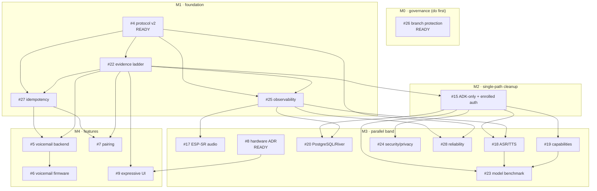

# Execution Plan — dispatcher for context-free agents

This file is the **single map** an agent reads to pick work. It does not replace the
issues — each issue carries its own machine-oriented **Execution header** (preflight,
owns-paths, claim protocol). This file gives the order, the dependency DAG, and the
one pick rule.

Source of truth for "can I start" is **GitHub-native issue dependencies** (`blocked_by`),
not this file. This file can drift; the API cannot. When in doubt, trust the API check
in step 1 of each issue's Execution header.

## The pick rule (the whole scheduler)

```
0. Bootstrap exception: while #26 is open and unassigned, pick #26 first. Governance
   must land before foundational PRs are merged even if a lower-numbered issue is ready.
1. List candidates:  gh issue list --repo diepgiahuy/ai-companion \
                       --label "status:ready" --state open --json number,title,assignees
2. Drop any with a non-empty assignees list (already claimed).
3. Outside the bootstrap exception, pick the LOWEST issue number remaining.
4. Run that issue's Execution header, checks 1–4, in order. If check 1 shows any
   blocker still open, the ready label is stale — skip it and pick the next.
5. Claim (header step 4), re-read the issue to verify you are still the sole intended
   owner, branch `issue-<n>`, then implement to the acceptance criteria.
6. Open a PR that closes the issue. On merge, reconcile newly-unblocked dependents to
   status:ready (see "Unblock on merge" below).
```

The assignee + `status:in-progress` claim is **idempotent coordination metadata, not a
transactional distributed lock**. Two agents racing the same free issue can both attempt
a claim. Therefore dispatchers should serialize candidate selection/claim when possible,
and every agent must re-read the issue immediately after claiming. If ownership is
ambiguous, stop before writing code and choose another ready issue.

## Conflict-minimizing ownership lanes

Every issue's Execution header declares an **owns-paths** lane. Parallel issue lanes are
designed to be disjoint and should minimize normal merge conflicts. This is not a formal
no-conflict guarantee: shared files such as README/evidence, protocol vectors, workflow
configuration, generated metadata, or required cross-cutting contracts can still overlap.
Do not casually write outside your lane. If a cross-lane edit is required, coordinate it
through an ordered/stacked PR or change the issue boundary rather than having agents race.

## Dependency DAG (verified against each issue's declared dependencies)



## Milestones / order

| Milestone | Issues | Gate to next |
|---|---|---|
| **M0 Governance** | #26 | main protected; stacked-PR merge rules documented |
| **M1 Foundation** | #4 → #22 → (#25, #27) | protocol v2 merged; Tier-1 software device runs; metrics + idempotency contracts exist |
| **M2 Cleanup** | #15 (+ finish #24 auth cut) | ADK sole runtime; enrolled-auth only; #22 parity proven |
| **M3 Parallel** | #17, #18, #20, #8, #24, #28, #19, #23 | conflict-minimizing lanes; each proven on the ladder |
| **M4 Features** | #5, #7 → #6, #9 | on protocol v2 + #27 + #22; #9 needs #8 physical proof |
| **Integration** | #2 / #21 acceptance | real-device proof via #3 (Tier 3) |

Note: **#3 (physical HIL)** is the only promotion path for audio/RF/display/power
claims and is not schedulable like a normal code task — it gates *evidence*, not every
merge.

## Startable RIGHT NOW (no open blockers)

- **#26** — governance (**bootstrap priority: do first**; it protects the merge sequence)
- **#4** — protocol v2 (merge unblocks most of M1)
- **#8** — hardware ADR (parallel; independent of software stack)

Everything else is `status:blocked` until its blockers close.

## Merge order for the open PR stack (verified)

PR **#16 is stacked on PR #14** (`codex/single-path-cleanup -> codex/interaction-protocol-contracts`),
not on `main`. Therefore:

1. Land **#26** governance first.
2. Review + merge **PR #14** (#4) into `main`. Fix the idempotency-scope gap first
   (ADR-002 says actor-scoped; server currently scopes per-session — reconcile).
3. Re-target / rebase **PR #16** (#15) after #14 is on `main`, then require exact-head
   CI against the new base before merge.
4. Reconcile **ADR-005** (#8): it pins ESP-IDF `<6.0`, but `main` is on **6.0.2**.

## Unblock on merge

GitHub-native dependencies remain authoritative; labels are only a dispatcher cache.
Until #26 lands an automatic reconciler, when an issue closes run:

```bash
# for each issue that was blocked by the just-closed issue:
#   re-check its blockers; if all closed, mark it ready
gh api repos/diepgiahuy/ai-companion/issues/<dep>/dependencies/blocked_by \
  --jq 'all(.[]; .state=="closed")' \
  && gh issue edit <dep> --add-label status:ready --remove-label status:blocked
```

#26 should add an idempotent issue/PR-close reconciler so the cache repairs itself.
The reconciler must always recompute from native `blocked_by`; it must not invent a
second dependency source of truth.
