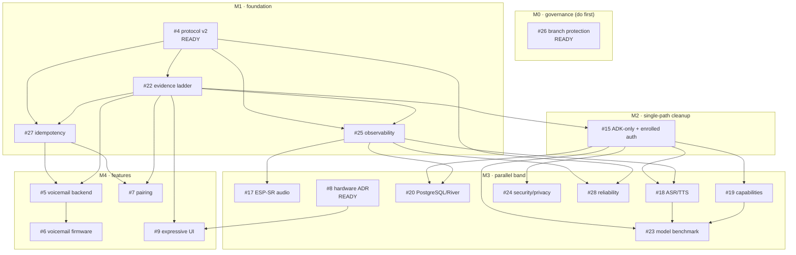

# Execution Plan — dispatcher for context-free agents

This file is the **single map** an agent reads to pick work. It does not replace the
issues — each issue carries its own machine-oriented **Execution header** (preflight,
owns-paths, claim protocol). This file gives the order, the dependency DAG, and the
one pick rule.

Source of truth for "can I start" is **GitHub-native issue dependencies** (`blocked_by`),
not this file. This file can drift; the API cannot. When in doubt, trust the API check
in step 1 of each issue's Execution header.

## The pick rule (the whole scheduler)

```
1. List candidates:  gh issue list --repo diepgiahuy/ai-companion \
                       --label "status:ready" --state open --json number,title,assignees
2. Drop any with a non-empty assignees list (already claimed).
3. Pick the LOWEST issue number remaining.
4. Run that issue's Execution header, checks 1–4, in order. If check 1 shows any
   blocker still open, the ready label is stale — skip it and pick the next.
5. Claim (header step 4), branch `issue-<n>`, implement to the acceptance criteria.
6. Open a PR that closes the issue. On merge, flip newly-unblocked dependents to
   status:ready (see "Unblock on merge" below).
```

Two agents running this simultaneously converge on **different** issues, because the
claim in step 5 (assignee + `status:in-progress`) is a lock: whoever assigns first
owns it; the other sees it assigned in step 2 and moves on.

## No-collision guarantee

Every issue's Execution header declares an **owns-paths** lane. Parallel issues have
**disjoint** lanes, so two agents in different lanes cannot produce a merge conflict.
Do not write outside your lane; if you must, that is a sign the issue boundary is
wrong — raise it rather than reaching across.

## Dependency DAG (verified against each issue's declared dependencies)



## Milestones / order

| Milestone | Issues | Gate to next |
|---|---|---|
| **M0 Governance** | #26 | main protected; stacked-PR merge rules documented |
| **M1 Foundation** | #4 → #22 → (#25, #27) | protocol v2 merged; Tier-1 software device runs; metrics + idempotency contracts exist |
| **M2 Cleanup** | #15 (+ finish #24 auth cut) | ADK sole runtime; enrolled-auth only; #22 parity proven |
| **M3 Parallel** | #17, #18, #20, #8, #24, #28, #19, #23 | disjoint lanes; each proven on the ladder |
| **M4 Features** | #5, #7 → #6, #9 | on protocol v2 + #27 + #22; #9 needs #8 physical proof |
| **Integration** | #2 / #21 acceptance | real-device proof via #3 (Tier 3) |

Note: **#3 (physical HIL)** is the only promotion path for audio/RF/display/power
claims and is not schedulable like a code task — it gates *evidence*, not merges.

## Startable RIGHT NOW (no open blockers)

- **#26** — governance (do first; it protects the merge sequence)
- **#4** — protocol v2 (merge unblocks most of M1)
- **#8** — hardware ADR (parallel; independent of software stack)

Everything else is `status:blocked` until its blockers close.

## Merge order for the open PR stack (verified)

PR **#16 is stacked on PR #14** (`codex/single-path-cleanup -> codex/interaction-protocol-contracts`),
not on `main`. Therefore:

1. Land **#26** governance first.
2. Review + merge **PR #14** (#4) into `main`. Fix the idempotency-scope gap first
   (ADR-002 says actor-scoped; server currently scopes per-session — reconcile).
3. Re-target / merge **PR #16** (#15) once #14 is on `main`.
4. Reconcile **ADR-005** (#8): it pins ESP-IDF `<6.0`, but `main` is on **6.0.2**.

## Unblock on merge

GitHub does not auto-flip labels. When an issue closes, run:

```bash
# for each issue that was blocked by the just-closed issue:
#   re-check its blockers; if all closed, mark it ready
gh api repos/diepgiahuy/ai-companion/issues/<dep>/dependencies/blocked_by \
  --jq 'all(.[]; .state=="closed")' \
  && gh issue edit <dep> --add-label status:ready --remove-label status:blocked
```

A small scheduled Action can do this repo-wide; until then it is a manual step in the
PR-merge checklist.
